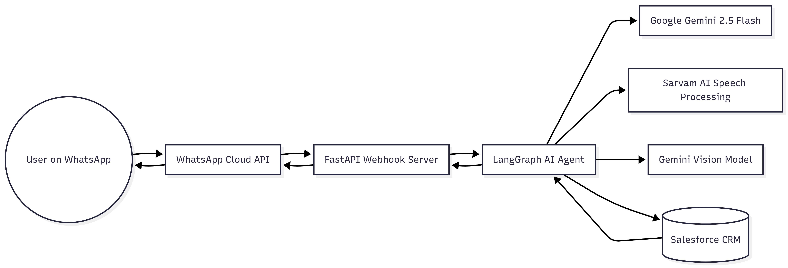

# AnyConnect: Salesforce AI Assistant for WhatsApp 

AnyConnect is an **AI-powered backend agent** designed to help businesses manage their daily operations seamlessly using **Salesforce CRM directly from WhatsApp**.

Built with **FastAPI**, **LangGraph**, and **Google Gemini 2.5 Flash**, it interprets user queries in plain English or Hindi (via voice or text), extracts information from images (like business cards), and maps them to the correct **Salesforce CRM operations**.

---

## ✨ Features

* **Conversational CRM Management:** Talk to your Salesforce database as if you are chatting with a human assistant.
* **Lead Management:** Create, update, delete, list, and export Leads to Excel directly from the chat.
* **Voice Note Support:** Send voice notes in regional languages (e.g., Hindi). The system uses **Sarvam AI** to transcribe and translate the audio into English instructions.
* **Image / Business Card Extraction:** Send an image of a business card. The AI processes the image using **Vision models** and automatically creates a lead in Salesforce.
* **Multi-Channel Support:** * FastAPI webhook for **WhatsApp Cloud API**
  * CLI interface (`main.py`) for **terminal testing**

---

## 🛠️ Tech Stack

| Category | Technology |
|---|---|
| **Backend Framework** | FastAPI, Uvicorn |
| **AI Agent Framework** | LangChain, LangGraph |
| **LLM** | Google Gemini 2.5 Flash |
| **CRM Integration** | simple-salesforce |
| **Speech-to-Text** | Sarvam AI |
| **Containerization** | Docker, Docker Compose |

---

## 🏗️ Architecture Diagram



### Architecture Flow

1. User sends text / voice / image via WhatsApp.
2. Message reaches FastAPI webhook.
3. FastAPI forwards request to LangGraph agent workflow.
4. AI agent decides which tool to call:
* Salesforce API
* Vision model
* Speech-to-text service


5. AI processes the request and returns the result.
6. Response is sent back to the WhatsApp user.

---

## ⚙️ Prerequisites & Environment Setup

Create a `.env` file in the root directory and add the following keys:

```ini
# Salesforce Configuration
SF_USERNAME=your_salesforce_username
SF_PASSWORD=your_salesforce_password
SF_TOKEN=your_salesforce_security_token

# Google AI (Gemini)
GOOGLE_API_KEY=your_google_api_key

# WhatsApp Cloud API Configuration
WHATSAPP_TOKEN=your_whatsapp_long_access_token
PHONE_NUMBER_ID=your_whatsapp_phone_number_id
VERIFY_TOKEN=your_custom_verify_token_for_webhook

# Sarvam AI (For Voice Note Transcription/Translation)
SARV_API=your_sarvam_api_key

```

---

## Installation & Running

### Option 1: Using Docker (Recommended)

Make sure Docker and Docker Compose are installed.

1. Clone the repository:
```bash
git clone [https://github.com/abdullahaarifshaikh/salesforce_ai_backend.git](https://github.com/abdullahaarifshaikh/salesforce_ai_backend.git)
cd salesforce_ai_backend

```


2. Start the application:
```bash
docker-compose up -d --build

```


The server will run on `http://localhost:8000`.

### Option 2: Run Locally (Python)

1. Create a virtual environment:
```bash
python -m venv .venv

```


2. Activate it:
* **Windows:** `.venv\Scripts\activate`
* **Linux / Mac:** `source .venv/bin/activate`


3. Install dependencies:
```bash
pip install -r requirements.txt

```


4. Run the FastAPI server:
```bash
uvicorn myAPI:app --host 0.0.0.0 --port 8000 --reload

```


### Option 3: Test via CLI Agent

You can run the LangGraph agent directly from the terminal to test the AI workflow without WhatsApp integration:

```bash
python main.py

```

---

## WhatsApp Webhook Setup

1. Go to the **Meta App Dashboard**.
2. Navigate to **WhatsApp → Configuration**.
3. Configure the webhook:
* **Callback URL:** `https://your-domain-or-ngrok.com/webhook`
* **Verify Token:** The exact value you set for `VERIFY_TOKEN` in your `.env` file.


4. Subscribe to the webhook field: **messages**.

### Local Testing with ngrok

If running locally, expose port 8000:

```bash
ngrok http 8000

```

*Example output:* `https://abc123.ngrok.io`
Use this URL as your webhook callback URL.

---

## 🧰 Available Tools (Agent Capabilities)

| Tool | Description |
| --- | --- |
| `add_lead` | Create a new Salesforce Lead |
| `update_lead` | Update existing lead information |
| `remove_lead` | Delete a lead |
| `list_leads` | Fetch leads with search filters |
| `export_leads_to_excel` | Export Salesforce leads to an `.xlsx` file |

---

## 📡 Example API Request

### Incoming WhatsApp Webhook Payload

**POST** `/webhook`

**Content-Type:** `application/json`

```json
{
  "messages": [
    {
      "from": "919999999999",
      "type": "text",
      "text": {
        "body": "Add a new lead named John from Tesla"
      }
    }
  ]
}

```

### 📤 Example API Response

```json
{
  "status": "success",
  "message": "Lead successfully created in Salesforce",
  "lead": {
    "first_name": "John",
    "company": "Tesla"
  }
}

```

---

## 📂 Project Structure

```text
salesforce_ai_backend
│
├── assets/
├── main.py
├── myAPI.py
├── requirements.txt
├── Dockerfile
├── docker-compose.yml
│
├── core/
│   └── workflow, state, model, salesforce_client
│
├── tools/
│   └── add_lead, update_lead, list_leads, etc.
│
└── config/
    └── settings.py

```

---

## 🤝 Contributing

Contributions, issues, and feature requests are welcome!

Feel free to fork the repository and submit pull requests.

## 👨‍💻 Author

**Abdullah Aarif** AI Student • Backend & AI Systems

[GitHub](https://github.com/abdullahaarifshaikh)

